**如果使用默认的滚动更新策略（RollingUpdate），新 Pod 即使 Readiness 失败，Kubernetes 也不会终止旧 Pod，从而导致服务永远不会中断，无法观察到 503 错误**。为了让回滚演练真实可靠，必须允许在演练时切换为 **Recreate 策略**，确保旧 Pod 全部终止、新 Pod 启动失败时服务彻底中断。

---

### 健康检查探针与灰度发布、全量发布、故障回滚联动

**目标**  

1. 按生产标准修改 Helm Chart：引入 `track` 标签、为 Deployment 配置可切换的更新策略、ConfigMap 隔离、探针路径固定为 `/message.php`（仅 Startup + Readiness，无 Liveness）。  
2. 部署稳定版（`track=stable`）和金丝雀版（`track=canary`），通过金丝雀 Ingress 实现 10% 灰度。  
3. 全量发布：原地升级稳定版 Release，删除金丝雀资源。  
4. 回滚演练：**切换策略为 Recreate，部署返回 500 的坏镜像，利用 Readiness 阻断流量，观察服务 503 后立即回滚**。

---

#### 1. 修改 Helm Chart 模板

##### 1.1 `values.yaml`（新增 `track`、`strategy`）
```yaml
track: "stable"
version: "v1"

# Deployment 配置
deployment:
  replicas: 3
  strategy:
    type: RollingUpdate        # 默认滚动更新
  image:
    php: registry.cn-chengdu.aliyuncs.com/cam-ns/message-board:v1
    nginx: registry.cn-chengdu.aliyuncs.com/cam-ns/nginx:alpine
  containerPort:
    php: 9000
    nginx: 80

# Service 配置
service:
  type: ClusterIP
  port: 80
  targetPort: 80

# Ingress 配置
ingress:
  enabled: false
  className: "nginx"
  host: ""
oss:
    url: "https://bucket01-gz-20260606-001.oss-cn-guangzhou.aliyuncs.com"
#数据库敏感信息未定义在此文件中，需通过 secret-values.yaml 提供
```

##### 1.2 `templates/deployment.yaml`
```yaml
apiVersion: apps/v1
kind: Deployment
metadata:
  name: {{ .Release.Name }}-deploy
  namespace: {{ .Release.Namespace }}
  labels:
    app: web
    track: {{ .Values.track }}
spec:
  replicas: {{ .Values.deployment.replicas }}
  strategy:
    type: {{ .Values.deployment.strategy.type }}
  selector:
    matchLabels:
      app: web
      track: {{ .Values.track }}
  template:
    metadata:
      labels:
        app: web
        track: {{ .Values.track }}
        version: {{ .Values.version }}
    spec:
      imagePullSecrets:
        - name: acr-auth
      containers:
      - name: php-fpm
        image: {{ .Values.deployment.image.php }}
        command: ["/usr/local/sbin/php-fpm", "-F"]
        ports:
        - containerPort: {{ .Values.deployment.containerPort.php }}
        env:
        - name: DB_HOST
          valueFrom:
            secretKeyRef:
              name: {{ .Release.Name }}-dbsecret
              key: rds-host
        - name: DB_NAME
          valueFrom:
            secretKeyRef:
              name: {{ .Release.Name }}-dbsecret
              key: db-name
        - name: DB_USER
          valueFrom:
            secretKeyRef:
              name: {{ .Release.Name }}-dbsecret
              key: db-user
        - name: DB_PASSWORD
          valueFrom:
            secretKeyRef:
              name: {{ .Release.Name }}-dbsecret
              key: db-password
        - name: OSS_URL
          valueFrom:
            configMapKeyRef:
              name: {{ .Release.Name }}-oss-config
              key: oss-url
      - name: nginx
        image: {{ .Values.deployment.image.nginx }}
        ports:
        - containerPort: {{ .Values.deployment.containerPort.nginx }}
        volumeMounts:
        - name: nginx-config
          mountPath: /etc/nginx/conf.d/default.conf
          subPath: default.conf
        # 添加健康检查探针
        startupProbe:
          httpGet:
            path: /message.php
            port: 80
          initialDelaySeconds: 5
          periodSeconds: 5
          timeoutSeconds: 2
          successThreshold: 1 
          failureThreshold: 12
        readinessProbe:
          httpGet:
            path: /message.php
            port: 80
          initialDelaySeconds: 0 
          periodSeconds: 5 
          timeoutSeconds: 2 
          successThreshold: 1 
          failureThreshold: 3
                            
      volumes:
      - name: nginx-config
        configMap:
          name: {{ .Release.Name }}-nginx-php-config
```

##### 1.3 `templates/service.yaml`
```yaml
apiVersion: v1
kind: Service
metadata:
  name: {{ .Release.Name }}-svc
  namespace: {{ .Release.Namespace }}
spec:
  type: {{ .Values.service.type }}
  selector:
    app: web
    track: {{ .Values.track }}：
  ports:
  - port: {{ .Values.service.port }}
    targetPort: {{ .Values.service.targetPort }}
```

##### 1.4 `templates/ingress.yaml`（条件创建）
```yaml
{{- if .Values.ingress.enabled }}
apiVersion: networking.k8s.io/v1
kind: Ingress
metadata:
  name: {{ .Release.Name }}-ingress
  namespace: {{ .Release.Namespace }}
spec:
  ingressClassName: {{ .Values.ingress.className }}
  rules:
  - host: {{ .Values.ingress.host }}
    http:
      paths:
      - path: /
        pathType: Prefix
        backend:
          service:
            name: {{ .Release.Name }}-svc
            port:
              number: {{ .Values.service.port }}
{{- end }}
```

##### 1.5 `templates/configmap.yaml`（名称包含 Release 名，同一namespace隔离）
```yaml
apiVersion: v1
kind: ConfigMap
metadata:
  name: {{ .Release.Name }}-nginx-php-config
  namespace: {{ .Release.Namespace }}
data:
  default.conf: |
    server {
        listen 80;
        server_name _;
        root /var/www/html;
        index message.php;

        location / {
            try_files $uri $uri/ /message.php?$args;
        }

        location ~ \.php$ {
            fastcgi_pass 127.0.0.1:9000;
            fastcgi_index message.php;
            fastcgi_param SCRIPT_FILENAME /var/www/html$fastcgi_script_name;
            include fastcgi_params;
        }
        # 添加标识响应头
        add_header X-Track {{ .Values.track }};
    }
```

**1.6`templates/oss-configmap.yaml`（名称包含 Release 名，隔离）**

```bash
apiVersion: v1
kind: ConfigMap
metadata:
  name: {{ .Release.Name }}-oss-config
  namespace: {{ .Release.Namespace }}
data:
  oss-url: {{ .Values.oss.url | quote }}
```

#### 2. 部署稳定版 v1（Release: `my-release`, track=stable）

```bash
helm install my-release . \
  -f values.yaml -f values-prod.yaml -f secret-values.yaml \
  --set track=stable -n prod
```

验证：
```bash
kubectl -n prod get endpoints
kubectl -n prod describe ingress my-release-ingress
INGRESS_IP=$(kubectl -n kube-system get svc nginx-ingress-lb -o jsonpath='{.status.loadBalancer.ingress[0].ip}')
curl -I http://${INGRESS_IP}/message.php | grep X-Track   # 输出 stable
```
> 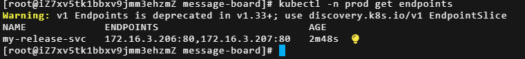
>
> Pod 列表
>
> 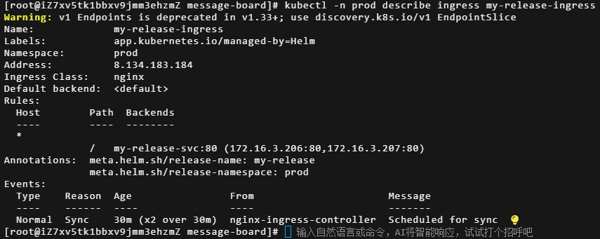
>
> Ingress详细信息
>
> 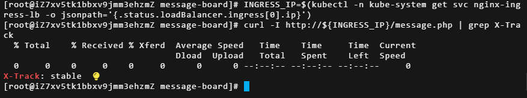
>
> curl 返回响应头X-Track：stable

#### 3. 部署金丝雀 Release（track=canary，镜像 v2，Ingress 禁用）

```bash
helm install my-release-canary . \
  -f values.yaml -f values-prod.yaml -f secret-values.yaml \
  --set track=canary \
  --set version=v2 \
  --set ingress.enabled=false \    #ingress.enabled=true会创建失败（host、path相同），canary ingress单独创建与Helm解耦
  --set deployment.image.php=registry.cn-chengdu.aliyuncs.com/cam-ns/message-board:v2 \
  -n prod
```

验证金丝雀 Service 端点：
```bash
kubectl -n prod describe svc my-release-canary-svc | grep Endpoints
# 只包含 canary Pod IP
```

#### 4. 创建金丝雀 Ingress（权重 10%）

`ingress-canary.yaml`:

```yaml
apiVersion: networking.k8s.io/v1
kind: Ingress
metadata:
  name: web-ingress-canary
  namespace: prod
  annotations:
    nginx.ingress.kubernetes.io/canary: "true"
    nginx.ingress.kubernetes.io/canary-weight: "10"
spec:
  ingressClassName: nginx
  rules:
  - host: ""
    http:
      paths:
      - path: /
        pathType: Prefix
        backend:
          service:
            name: my-release-canary-svc
            port:
              number: 80
```
```bash
kubectl apply -f ingress-canary.yaml
kubectl -n prod describe ingress web-ingress-canary
```

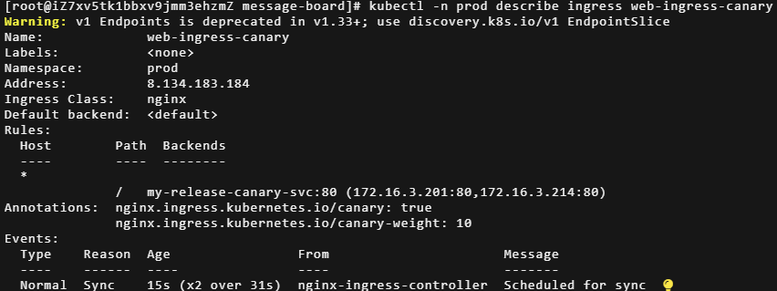

验证分流：

```bash
for i in {1..50}; do curl -sI http://${INGRESS_IP}/message.php | grep X-Track; done | sort | uniq -c
# 预期45 stable，5 canary
```
> 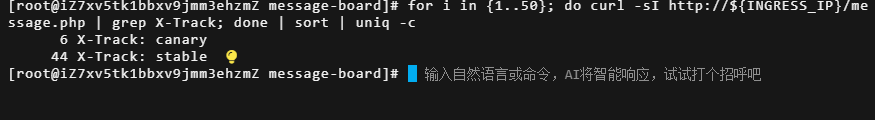
>
> 分流比例约9：1。

---

#### 5. 全量发布（升级稳定版到 v2，清理金丝雀）

```bash
helm upgrade my-release . \
  -f values.yaml -f values-prod.yaml -f secret-values.yaml \
  --set track=stable \
  --set version=v2 \
  --set deployment.image.php=registry.cn-chengdu.aliyuncs.com/cam-ns/message-board:v2 \
  -n prod
```
清理金丝雀：
```bash
kubectl delete ingress web-ingress-canary -n prod
helm uninstall my-release-canary -n prod
```
验证全部流量返回 stable（实际已是 v2）：

```bash
for i in {1..50}; do curl -sI http://${INGRESS_IP}/message.php | grep X-Track; done | sort | uniq -c
# 全部 stable
```

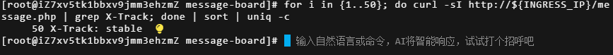

全量发布后返回响应头全部为stable

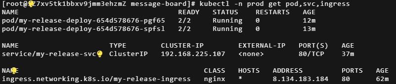

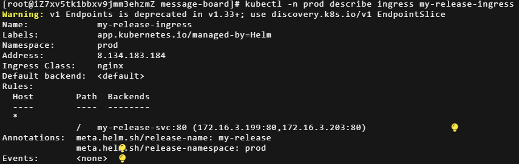

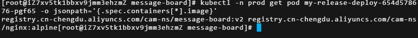

清理后金丝雀资源后的资源列表

---

#### 6. 回滚演练（Recreate 策略 + 坏镜像，制造 503）

**6.1 构建坏镜像**  
修改 `message.php` 开头：
```php
<?php
http_response_code(500);
echo "Simulated Error";
exit;
```
构建并推送，记录 Tag： `bad`。

**6.2 开启监控**（使用 `tmux`分屏）

- 终端 1：`kubectl -n prod get pods -w`
- 终端 2：循环监控 HTTP 状态码
```bash
#变量定义
INGRESS_IP=$(kubectl -n kube-system get svc nginx-ingress-lb -o jsonpath='{.status.loadBalancer.ingress[0].ip}')
#验证变量输出
echo $INGRESS_IP
#循环监控 HTTP 状态码
while true; do
    STATUS=$(curl -s -o /dev/null -w "%{http_code}" http://${INGRESS_IP}/message.php)
    echo "$(date +%T) HTTP $STATUS"
    sleep 1
done
```

**6.3 部署坏镜像（切换为 Recreate 策略）**

```bash
helm upgrade my-release . \
  -f values.yaml -f values-prod.yaml -f secret-values.yaml \
  --set track=stable \
  --set version=bad \
  --set deployment.image.php=registry.cn-chengdu.aliyuncs.com/cam-ns/message-board:bad \
  --set deployment.strategy.type=Recreate \
  -n prod
```

**6.4 观察现象**
- 由于 Recreate 策略，所有旧 Pod 被**立即终止**。
- 新 Pod 启动，`/message.php` 返回 500，Readiness 探测失败，READY 显示 `1/2`。
- Service 后端无任何健康 Pod，Ingress 返回 `503 Service Unavailable`。
- 终端 2 显示状态码从 `200` 突变为 `503`。

**6.5 执行回滚**
观察到连续 503 后，立即回滚到上一个正常版本：

```bash
helm history my-release -n prod
helm rollback my-release 6 -n prod        # 替换为实际的 REVISION 号
```
回滚后，服务恢复 200，Pod 重新变为 Ready。

> 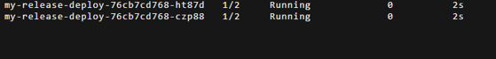
>
> 部署镜像message-board:bad，重建Pod状态：READY 1/2
>
> 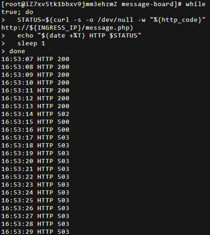
>
> 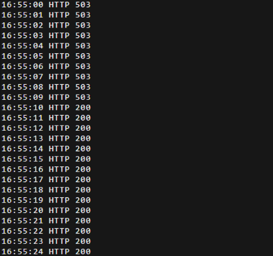
>
> 状态码200→503→200变化过程
>
> 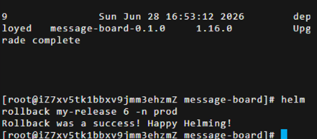
>
> helm history查看历史release版本、回滚到历史版本6。

### 方案确认
- **Selector 不可变**：通过 `track` 标签实现，升级时 `track` 值不变。
- **服务中断模拟**：引入 `strategy` 配置，演练时切换为 `Recreate`，确保旧 Pod 立即删除，新 Pod 失败导致完全中断。
- **探针深入业务**：`/message.php` 贯穿全链路，业务错误直接反映在就绪状态上。
- **灰度与全量**：清晰、安全，资源隔离彻底。

