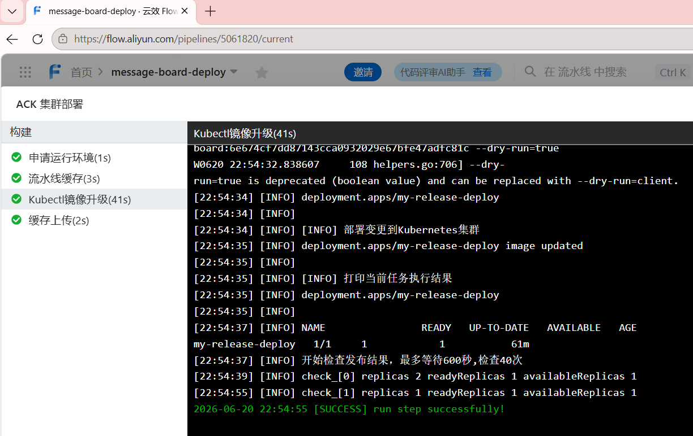
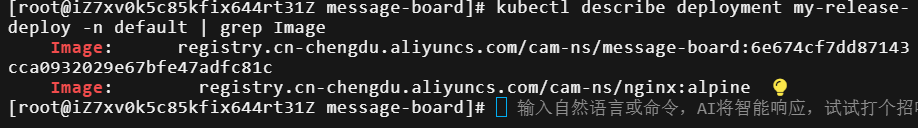
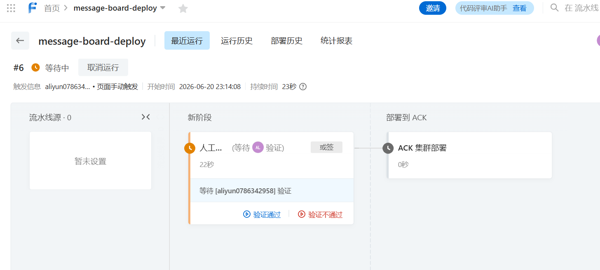
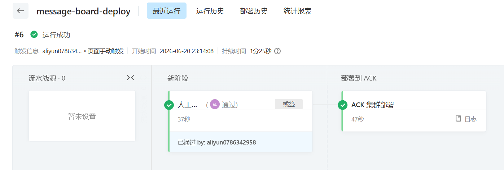
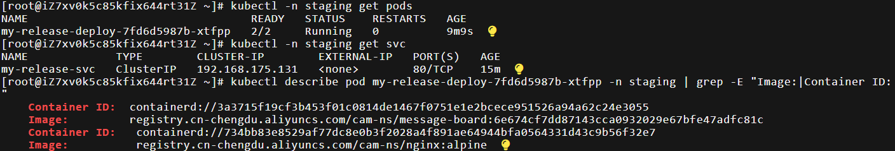
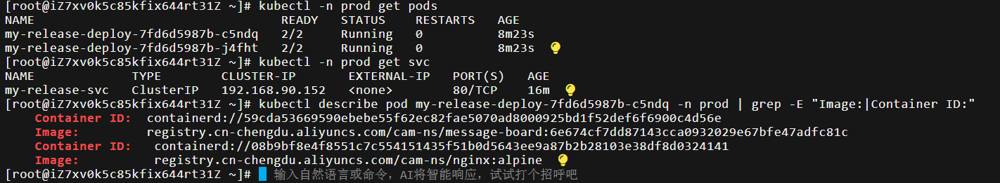

### 部署流水线 + 构建/部署分离

**目标**：创建一条独立的部署流水线，接受 `ImageTag` 和 `Namespace` 参数，验证其能成功更新 Deployment 镜像。

**前置确认**  
确保构建流水线 `message-board-build` 已成功运行至少一次，并在成都 ACR 中产生了一个镜像 Tag。记下 Tag：6e674cf7dd87143cca0932029e67bfe47adfc81c。

#### 实操

**步骤 1：创建部署流水线**
1. 登录云效 Flow，进入项目。
2. 点击 **新建流水线** → 选择 **空模板**。
3. 流水线名称填 `message-board-deploy`，点击 **创建**。

**步骤 2：配置流水线变量（参数）**

1. 在流水线编辑页面，点击 **变量** 选项卡。
2. 添加两个字符变量：
   - 变量名：`ImageTag`，默认值填写任意Tag，描述：`PHP 镜像 Tag`，开启`“运行时设置”`开关，默认值不可留空，此处填写任意Tag即可
   - 变量名：`Namespace`，默认值：`default`，描述：`目标命名空间`，开启`“运行时设置”`开关
3. 保存变量。

**步骤 3：添加“ACK 集群部署”任务**

1. 点击 **添加阶段**，阶段名称填**部署到 ACK**。
2. 下载流水线源：选择不下载流水线源
3. 在该阶段下，点击 **添加任务**，搜索 **Kubernetes 发布**，选择 **Kubectl镜像升级**。
4. 配置任务：
   - **集群连接**：选择已有广州 ACK 集群k8s-cluster。
   - **Kubectl版本**：选择与集群适配的Kubectl版本v1.28.15
   - **命名空间**：填入 `{.Namespace}`。
   - **Workloads（工作负载）类型**：选择 `Deployment`。
   - **Workloads（工作负载）名称**：输入 `.Release.Name-deploy`（.Release.Name为执行helm install部署应用时输入的Release名称）。
   - **容器名称**：填写 `php-fpm`。
   - **镜像**：填入 `registry.cn-chengdu.aliyuncs.com/cam-ns/message-board:${ImageTag}`。
5. 点击 **保存**，然后保存整个流水线。

**步骤 4：运行部署流水线**

1. 点击 **运行**。
2. 在弹出的参数输入框中：
   - `ImageTag`：填写构建流水线构建的镜像（已传入到ACR）对应的Tag：6e674cf7dd87143cca0932029e67bfe47adfc81c（ImageTag通常为git push产生的哈希值）。
   - `Namespace`：填写 `default`。
3. 点击 **运行**。
4. 观察运行日志，看到“成功”提示。

**步骤 5：验证 ACK 集群中的更新**
```bash
kubectl describe deployment my-release -n default | grep Image
```
确认 `php-fpm` 容器的镜像已变成指定Tag（git push产生的哈希值）。

> 
>
> 
>
> 云效 Flow 部署成功、终端显示更新后的镜像 Tag。

---

### 多环境部署 + 人工审批卡点

**目标**：创建 `staging` 和 `prod` 命名空间，在部署流水线中加入人工审批，实现一条流水线参数化部署到两个环境。

**前置确认**：部署流水线已能成功更新 `default` 命名空间的 Deployment。记下上次用过的那个镜像 Tag，以确保部署到 `staging` 和 `prod` 的镜像一致性。

---

#### 实操

**步骤 1：创建 staging 和 prod 命名空间**

```bash
kubectl create namespace staging
kubectl create namespace prod
```
验证：

```bash
kubectl get namespaces | grep -E "staging|prod"
```

**步骤 2：为测试环境staging和生产环境pro通过helm install部署应用所需的service、pod、ingress、configmap等集群资源，否则后续验证staging /prod环境无资源信息输出**

**步骤 3：修改部署流水线，加入人工审批卡点**

1. 进入云效 Flow，编辑 `message-board-deploy` 流水线。
2. 在现有阶段的左侧，**添加一个新阶段**，命名为“人工审批”。
3. 在该阶段添加任务，搜索任务名称**人工卡点**，选择 **人工卡点**，设置任务名称为“人工审批“。
4. 配置审批内容：
   - **验证者方式**：或签（一名审批人同意或拒绝即可）
   - **验证者类型**：成员（选择组织成员作为审核人员）
   - **验证人**：验证人选择自己即可
   - **超时时间**：设置为无超时时间
5. 将原有的“部署到 ACK”阶段拖到审批阶段**之后**。
6. 保存流水线。

**步骤 4：部署到 staging 环境**

1. 运行 `message-board-deploy`。
2. 输入参数：
   - `ImageTag`：填写与之前在 `default` 命名空间测试时相同的镜像 Tag。
   - `Namespace`：填写 `staging`。
3. 流水线运行到审批阶段会暂停，接着在云效收到审批通知。
4. 点击 **同意**，流水线继续执行，将应用部署到 `staging` 命名空间。
5. 验证 staging 环境：
   ```bash
   kubectl -n staging get pods
   kubectl -n staging get svc
   ```
   确认 Pod 正常运行，Service 已创建。

**步骤 4：部署到 prod 环境**
1. 再次运行 `message-board-deploy`。
2. 输入参数：
   - `ImageTag`：填写**与 staging 完全相同的镜像 Tag**。
   - `Namespace`：填写 `prod`。
3. 同样经过审批，确认后部署到 `prod`。
4. 验证 prod 环境：
   ```bash
   kubectl -n prod get pods
   kubectl -n prod get svc
   ```
   prod 环境应与 staging 相同。

> 审批弹窗界面
>
> 
>
> staging命名空间下的 Pod 列表prod命名空间下的 Pod 列表，两命名空间下容器镜像message-board的Tag均为6e674cf7dd87143cca0932029e67bfe47adfc81c

