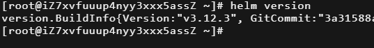
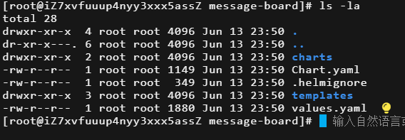
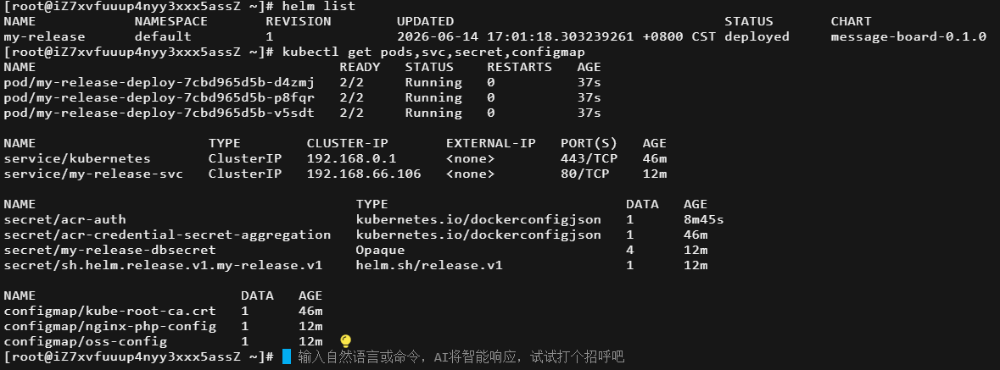
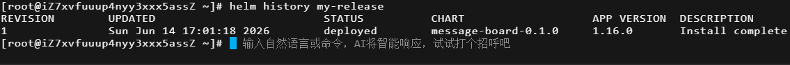
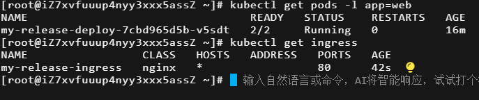
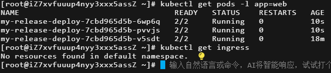
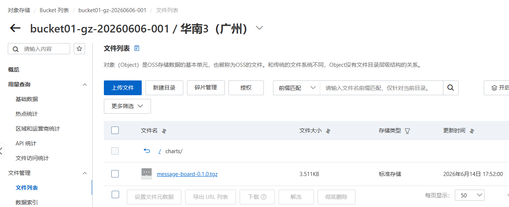

## 使用 Helm 模板化管理留言板应用

本实验使用 `message-board:optimized` 作为基础镜像，后续实验使用 `v1`/`v2` 标签

### 一、准备 Helm 环境

确保已安装 Helm 3.x，并已通过 `kubectl` 连接到 ACK 集群。

```bash
helm version
```

> 
>
> 输出 Helm 版本信息，确认 Helm 已就绪。

### 二、创建 Helm Chart 骨架

```bash
helm create message-board
cd message-board
```

此时生成的目录结构如下：

```
message-board/
├── Chart.yaml
├── values.yaml
├── charts/
├── templates/
│   ├── deployment.yaml
│   ├── service.yaml
│   └── ...
└── .helmignore
```

> 
>
> 文件管理器中的目录结构截图。

### 三、设计 `values.yaml` 与变量原则

#### 变量设计原则

1. **开箱即用**：所有非敏感变量都应提供合理的默认值，确保 `helm install` 不携带任何额外参数也能成功部署。
2. **敏感信息强制输入**：数据库密码等敏感信息**不设默认值**，由用户安装时主动提供（或通过 `--set` 传入），避免密码泄漏到版本控制。
3. **按资源分组**：使用 YAML 的嵌套结构按资源类型组织变量（`deployment`、`service`、`ingress`、`secret`），提高可读性。
4. **可选功能开关**：对非必须资源（如 Ingress）使用布尔型开关 `enabled`，允许用户按需启用。
5. **使用 Helm 内置命名空间管理**：所有模板统一使用 `{{ .Release.Namespace }}`，命名空间由 `helm install -n <namespace>` 或 `--create-namespace` 控制，不在 `values.yaml` 中硬编码。

#### `values.yaml` 完整内容

在 Chart 根目录下编辑 `values.yaml`，替换为以下内容：

```yaml
# values.yaml - 非敏感配置，可提交到代码仓库（如 GitHub、GitLab 等）
# Deployment 配置
deployment:
  replicas: 3
  image:
    php: registry.cn-chengdu.aliyuncs.com/cam-ns/message-board:optimized
    nginx: registry.cn-chengdu.aliyuncs.com/cam-ns/nginx:alpine
  containerPort:
    php: 9000
    nginx: 80

# Service 配置
service:
  type: ClusterIP
  port: 80
  targetPort: 80

# Ingress 配置
ingress:
  enabled: false              # 默认关闭，需要时开启
  className: "nginx"          # 根据集群 ingress class 名称调整
  host: ""                    # 留空表示匹配所有域名，也可设置具体域名

# 注意：数据库敏感信息（rdsHost, dbName, dbUser, dbPassword）未定义在此文件中
# 它们必须在安装时通过专用的 secret-values.yaml 或 --set 提供
```

### 四、编写模板文件

将各个 YAML 改造为 Helm 模板，均放置在 `templates/` 目录下。

#### 4.1 `templates/configmap.yaml`（Nginx 反向代理配置）

```yaml
apiVersion: v1
kind: ConfigMap
metadata:
  name: nginx-php-config
  namespace: {{ .Release.Namespace }}
data:
  default.conf: |
    server {
        listen 80;
        server_name _;
        root /var/www/html;
        index message.php;

        location / {
            try_files $uri $uri/ /message.php?$args;
        }

        location ~ \.php$ {
            fastcgi_pass 127.0.0.1:9000;
            fastcgi_index message.php;
            fastcgi_param SCRIPT_FILENAME /var/www/html$fastcgi_script_name;
            include fastcgi_params;
        }
    }
```

#### 4.2 `templates/deployment.yaml`（Sidecar 模式：PHP-FPM + Nginx）

```yaml
apiVersion: apps/v1
kind: Deployment
metadata:
  name: {{ .Release.Name }}-deploy
  namespace: {{ .Release.Namespace }}
  labels:
    app: web
spec:
  replicas: {{ .Values.deployment.replicas }}
  selector:
    matchLabels:
      app: web
  template:
    metadata:
      labels:
        app: web
    spec:
      imagePullSecrets:
        - name: acr-auth
      containers:
      - name: php-fpm
        image: {{ .Values.deployment.image.php }}
        command: ["/usr/local/sbin/php-fpm", "-F"]
        ports:
        - containerPort: {{ .Values.deployment.containerPort.php }}
        env:
        - name: DB_HOST
          valueFrom:
            secretKeyRef:
              name: {{ .Release.Name }}-dbsecret
              key: rds-host
        - name: DB_NAME
          valueFrom:
            secretKeyRef:
              name: {{ .Release.Name }}-dbsecret
              key: db-name
        - name: DB_USER
          valueFrom:
            secretKeyRef:
              name: {{ .Release.Name }}-dbsecret
              key: db-user
        - name: DB_PASSWORD
          valueFrom:
            secretKeyRef:
              name: {{ .Release.Name }}-dbsecret
              key: db-password
      - name: nginx
        image: {{ .Values.deployment.image.nginx }}
        ports:
        - containerPort: {{ .Values.deployment.containerPort.nginx }}
        volumeMounts:
        - name: nginx-config
          mountPath: /etc/nginx/conf.d/default.conf
          subPath: default.conf
      volumes:
      - name: nginx-config
        configMap:
          name: nginx-php-config
```

#### 4.3 `templates/service.yaml`（ClusterIP Service）

```yaml
apiVersion: v1
kind: Service
metadata:
  name: {{ .Release.Name }}-svc
  namespace: {{ .Release.Namespace }}
spec:
  type: {{ .Values.service.type }}
  selector:
    app: web
  ports:
  - port: {{ .Values.service.port }}
    targetPort: {{ .Values.service.targetPort }}
```

#### 4.4 `templates/secret.yaml`（数据库连接信息，使用 stringData 自动编码）

```yaml
apiVersion: v1
kind: Secret
metadata:
  name: {{ .Release.Name }}-dbsecret
  namespace: {{ .Release.Namespace }}
type: Opaque
stringData:
  rds-host: {{ required "secret.rdsHost is required" .Values.secret.rdsHost }}
  db-name: {{ required "secret.dbName is required" .Values.secret.dbName }}
  db-user: {{ required "secret.dbUser is required" .Values.secret.dbUser }}
  db-password: {{ required "secret.dbPassword is required" .Values.secret.dbPassword }}
```

> **说明**：使用 `stringData` 字段，用户提供明文，Helm 渲染时自动进行 Base64 编码。`required` 函数确保这些值在安装时必须提供。

#### 4.5 `templates/ingress.yaml`（条件创建，可选）

```yaml
{{- if .Values.ingress.enabled }}
apiVersion: networking.k8s.io/v1
kind: Ingress
metadata:
  name: {{ .Release.Name }}-ingress
  namespace: {{ .Release.Namespace }}
spec:
  ingressClassName: {{ .Values.ingress.className }}
  rules:
  - host: {{ .Values.ingress.host }}
    http:
      paths:
      - path: /
        pathType: Prefix
        backend:
          service:
            name: {{ .Release.Name }}-svc
            port:
              number: {{ .Values.service.port }}
{{- end }}
```

---

### 五、创建独立的敏感信息文件 `secret-values.yaml`

在 Chart 根目录或安全位置创建 `secret-values.yaml`，用于存放数据库连接信息。

```yaml
# secret-values.yaml —— 切勿提交到版本控制系统！
secret:
  rdsHost: "rm-7xvoy8dtty93g9m3q.rwlb.rds.aliyuncs.com"
  dbName: "liuyan"
  dbUser: "db_admin"
  dbPassword: "Camellia@2651"
```

**重要**：将 `secret-values.yaml` 加入 `.gitignore`，防止泄露。

安装时同时加载两个 values 文件：

```bash
# 确保当前位于 message-board 的父目录
helm install my-release ./message-board \
  -f ./message-board/values.yaml \
  -f ./message-board/secret-values.yaml \
  -n default
```

---

### 六、创建环境差异覆盖文件（选择性覆盖默认值）

为开发环境创建一个 `values-dev.yaml`，覆盖副本数、关闭 Ingress、修改 Ingress 域名。

```yaml
# values-dev.yaml
deployment:
  replicas: 1

ingress:
  enabled: false
  host: "dev.message-board.example.com"
```

> **使用方式**：`helm install my-release ./message-board -f values-dev.yaml -f secret-values.yaml`

#### 七、安装 Chart 并体验版本管理

**7.1 安装第一个 Release**

```bash
# 确保当前位于 message-board 的父目录
helm install my-release ./message-board \
  -f ./message-board/secret-values.yaml \
  -n default
```

检查所有资源是否正常创建：

```bash
helm list
kubectl get pods,svc,secret,configmap
```

>  my-board 部署成功，3 个 Pod 状态均为 Running。

**7.2 查看 Release 历史**

```bash
helm history my-release
```

> 显示当前版本为 1。

**7.3 升级——修改副本数并开启 Ingress**

在message-board/ 目录下创建 `values-dev.yaml`，通过 `values-dev.yaml` 覆盖默认配置，将 `ingress.enabled` 从 `false` 改为 `true`，以开启 Ingress

```yaml
deployment:
  replicas: 1

ingress:
  enabled: true
```

执行升级（同时必须带上数据库密码文件）：

```bash
helm upgrade my-release ./message-board \
  -f ./message-board/secret-values.yaml \
  -f ./message-board/values-dev.yaml
```

验证：

```bash
kubectl get pods -l app=web          # 应显示 1 个 Pod
kubectl get ingress                  # 应出现 my-release-ingress
```

> 
>
> Pod 数量变为 1，Ingress 资源成功创建。

**7.4 回滚到上一个版本**

```bash
helm rollback my-release 1
```

确认回滚结果：

```bash
kubectl get pods -l app=web          # Pod 数量恢复为 3
kubectl get ingress                  # Ingress 已被删除
```

> 
>
> Pod数量回到 3 个，`kubectl get ingress` 输出 `No resources found`。

### 八、打包Chart上传到OSS

ACR 个人版不支持 Helm Chart 托管，故使用 OSS 作为替代分发方式

**8.1 打包 Chart**

```bash
helm package ./message-board
# 会生成 message-board-0.1.0.tgz
```

**8.2 分发方式（OSS 作为静态仓库）**

上传 `.tgz` 文件到广州 OSS Bucket，并设为公共读。



