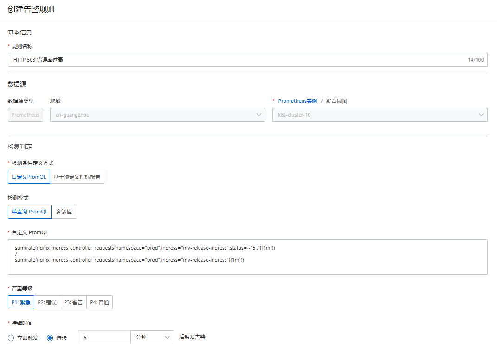
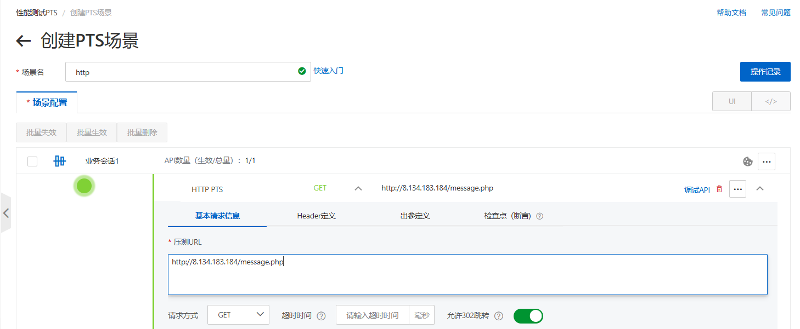
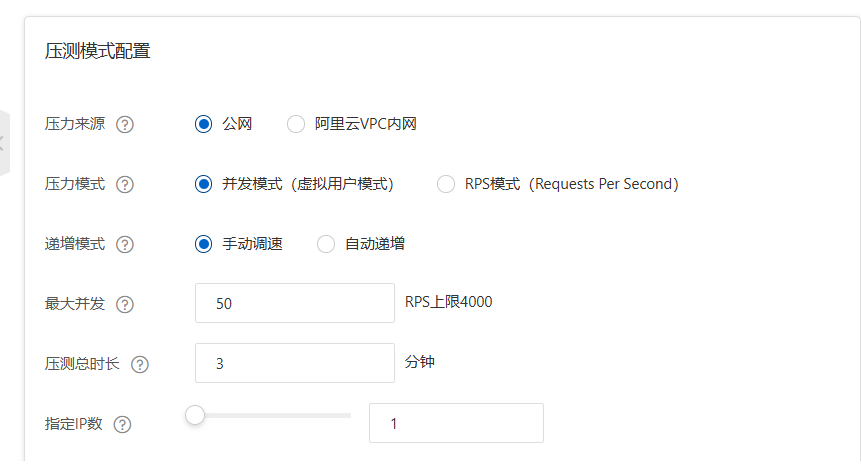
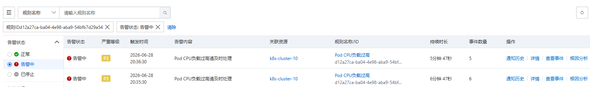
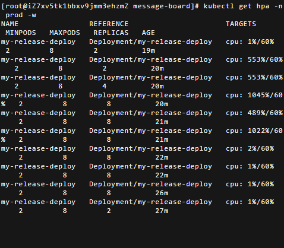

## 一、Prometheus 监控告警

**目标**：开启阿里云 Prometheus 监控托管，创建 CPU 和 HTTP 503 错误率告警规则，通过 PTS 压测验证告警状态流转。

**步骤 1：开启 Prometheus 监控托管**

ACK 控制台 → 集群详情 → **运维管理** → **Prometheus 监控**，点击 **开启**。

**步骤 2：创建 CPU 告警规则**

-   **规则名称**：`Pod CPU 负载过高`
-   **数据源**：地域 `cn-guangzhou`，集群 `k8s-cluster-10`
-   **指标**：CPU 使用率（for k8s）
-   **检测条件**：CPU 使用率 `>= 70%`
-   **持续时间**：3 分钟
-   **告警检测周期**：1 分钟
-   **严重等级**：P3 警告
-   **通知对象**：联系人 `ack_aliyun0786342958`，集成至 ARMS 告警管理
-   **通道沉默周期**：24 小时
-   **告警通知模板**：`节点: {{$labels.pod_name}} CPU 使用率 {{$labels.metrics_params_opt_label_value}} {{$labels.metrics_params_value}}%，当前值 {{ printf "%.2f" $value }}%`

**步骤 3：创建 HTTP 503 错误率告警规则**

- **规则名称**：`HTTP 503 错误率过高`

- **数据源**：地域 `cn-guangzhou`，集群 `k8s-cluster-10`

- **检测方式**：自定义 PromQL

  ```promql
  sum(rate(nginx_ingress_controller_requests{namespace="prod",ingress="my-release-ingress",status=~"5.."}[1m]))
  /
  sum(rate(nginx_ingress_controller_requests{namespace="prod",ingress="my-release-ingress"}[1m]))
  ```

- **持续时间**：5 分钟

- **严重等级**：P1 紧急

> 
>
> PromQL 告警规则配置详情页，展示自定义查询语句和触发条件。

**步骤 4：PTS 压测验证告警**

-   **压测 URL**：`http://8.134.183.184/message.php`
-   **请求方式**：GET
-   **压力来源**：公网
-   **压力模式**：虚拟用户模式，阶梯递增
-   **最大虚拟用户数**：50
-   **RPS 上限**：4000
-   **压测总时长**：3 分钟

> 
>
> 
>
> PTS 压测场景配置

压测后 CPU 使用率升高，但告警规则状态始终为 Normal，未触发。


**排错过程**

**问题 1：集群 Pod 监控没有任何数据**

排查发现 Prometheus Agent Pod 处于 **Pending** 状态。通过 `kubectl describe pod` 查看 Events，显示 `0/1 nodes are available: 1 Insufficient memory`。

**根因**：Prometheus Agent 请求的内存（Requests: 256Mi）在单节点 4GB 集群上无法满足，调度器找不到可用内存。

**解决**：增加一个 Worker 节点扩容集群。新节点加入后，Agent 成功调度并变为 `Running`。

**问题 2：告警规则不触发**

Agent 运行正常后，压测时告警依然 Normal。检查 Deployment 发现 `resources: {}`，未设置资源请求。

**根因**：CPU 使用率百分比指标依赖 `resources.requests.cpu`，未设置时分母为 0，指标无法计算。

**解决**：在 Helm Chart 的 Deployment 模板中为两个容器添加资源请求（`php-fpm` 设 `cpu: 100m, memory: 128Mi`，`nginx` 设 `cpu: 50m, memory: 64Mi`），执行 `helm upgrade`。

**问题 3：添加资源请求后告警仍不触发**

**根因**：指标依赖 `kube-state-metrics` 正确暴露资源请求信息，存在采集延迟或数据缺失。

**解决**：修改告警规则，改用绝对 CPU 使用率的 PromQL 替代百分比指标。最终告警状态从 Normal → Pending → Firing。

> 
>
> 告警规则 Firing 状态

**问题 4：触发告警但未收到通知**

**根因**：阿里云 Prometheus 托管服务已全面接入 ARMS 告警管理，通知对象为联系人 `ack_aliyun0786342958`。需在 ARMS 告警管理中心配置通知策略，才能将告警事件推送到通知渠道。

**解决方案**：采用替代验证方案——在告警规则页面直接观察状态变化，当状态变为 Firing 时截图作为告警触发的证据。


**实验总结**

-   HTTP 503 错误率告警：已创建规则，但因回滚演练中故障持续时间较短（手动快速回滚），未达到告警规则 5 分钟的触发条件，未实际触发验证。
-   Prometheus Agent 因单节点内存不足 Pending，增加节点后恢复。
-   CPU 使用率（for k8s）必须配置 `resources.requests.cpu` 才能计算，且存在采集延迟。
-   `container_cpu_usage_seconds_total` 绝对值指标更直接可靠。
-   阿里云托管 Prometheus 告警通知需通过 ARMS 告警管理配置。

---

## 二、HPA 弹性伸缩验证

**目标**：为留言板 Deployment 配置 HPA 弹性伸缩，通过 `wrk` 压测触发自动扩容，观察副本数增加；压测结束后验证自动缩容。

**步骤 1：确认 Metrics Server 正常**

```bash
kubectl top pods -n prod
```

能正常显示 CPU 和 MEMORY，说明 Metrics Server 工作正常。

**步骤 2：配置 HPA**

```bash
kubectl autoscale deployment my-release-deploy \
  --cpu-percent=60 \
  --min=2 \
  --max=8 \
  -n prod
```

验证：

```bash
kubectl get hpa -n prod
```

输出显示 TARGETS 为 `<unknown>/60%`。

**步骤 3：压测验证 HPA 扩容**

- 开启三个终端：
  - 终端 1：`kubectl get pods -n prod -w`
  - 终端 2：`kubectl get hpa -n prod -w`
  - 终端 3：`wrk -t 4 -c 200 -d 300s http://8.134.183.184/message.php`
- 压测持续 5 分钟，Pod 数量始终为 2，HPA 的 TARGETS 始终显示 `<unknown>/60%`。


**排错过程**

**问题 1：HPA 始终显示 `<unknown>/60%`**

**排查**：

1. 确认 Deployment 已添加 `resources.requests.cpu`（监控告警排错时已修复）。

2. 确认 Metrics Server 正常运行（`kubectl top pods` 有数据）。

3. 确认 API 服务正常：

   ```bash
   kubectl get apiservice v1beta1.metrics.k8s.io
   ```

   输出 `AVAILABLE: True`。

4. 重启 Metrics Server：

   ```bash
   kubectl delete pod -n kube-system -l k8s-app=metrics-server
   ```

   等待新 Pod Running，HPA 仍显示 `<unknown>`。

5. 查看 HPA 详细状态：

   ```bash
   kubectl describe hpa my-release-deploy -n prod
   ```

   Events 显示：

   ```
   failed to get cpu utilization: missing request for cpu in container php-fpm of Pod my-release-deploy-654d578676-hrkk9
   ```

**根因**：HPA 是在添加资源请求**之前**创建的，它记录的是旧 Pod 的状态。虽然 Deployment 已更新，但旧 Pod `654d578676-hrkk9` 还未被替换，HPA 仍然看到这个没有资源请求的旧 Pod，导致无法计算 CPU 使用率百分比。

**解决**：手动触发 Pod 重建：

```bash
kubectl rollout restart deployment my-release-deploy -n prod
```

等待新 Pod Running，旧 Pod 终止，HPA 成功显示 `cpu: 1%/60%`。

**问题 2：滚动更新时新 Pod Pending**

**现象**：执行 `kubectl rollout restart` 后，新 Pod 处于 Pending 状态，提示 `Insufficient memory`。

**排查**：查看 Pending Pod 详情：

```bash
kubectl describe pod -n prod <new-pod-name>
```

Events 显示内存不足，且 GOATScaler 尝试自动扩节点但失败：

```
InvalidAccountStatus.NotEnoughBalance
```

发现集群中 Prometheus Agent 占用了大量内存。

**解决**：临时停掉 Prometheus 监控组件释放内存：

```bash
kubectl scale deployment -n arms-prom arms-prometheus-ack-arms-prometheus --replicas=0
kubectl scale deployment -n arms-prom kube-state-metrics --replicas=0
kubectl scale deployment -n arms-prom o11y-addon-controller --replicas=0
kubectl delete daemonset -n arms-prom node-exporter
```

内存释放后，新 Pod 成功调度，滚动更新完成。

**问题 3：HPA 扩容后大量 Pod Pending**

**现象**：压测时 HPA 将副本数从 2 扩到 8，但新 Pod 全部因内存不足而 Pending。

**根因**：HPA 只负责计算期望副本数并修改 Deployment，不关心集群是否有足够资源运行新 Pod。当节点内存被现有 Pod 占满时，新 Pod 无法调度。

**结果**：压测结束后，CPU 使用率降至 1%，HPA 等待约 5分钟后触发缩容，所有 Pending Pod 被优先终止，副本数恢复到 2。

> 
>
> 压测时 HPA 的 TARGETS 飙升、REPLICAS 从 2 自动增加到 8 的终端输出，以及压测结束后回落至 2 的完整过程

**实验总结**

-   HPA 显示 `<unknown>` 的常见原因：Pod 未设置 `resources.requests.cpu`、Metrics Server 异常、或 HPA 缓存了旧 Pod 状态。
-   `kubectl rollout restart` 可强制重建 Pod，解决 HPA 缓存旧状态的问题。
-   单节点测试集群资源紧张时，需手动管理组件优先级，牺牲监控组件为业务 Pod 腾出空间。
