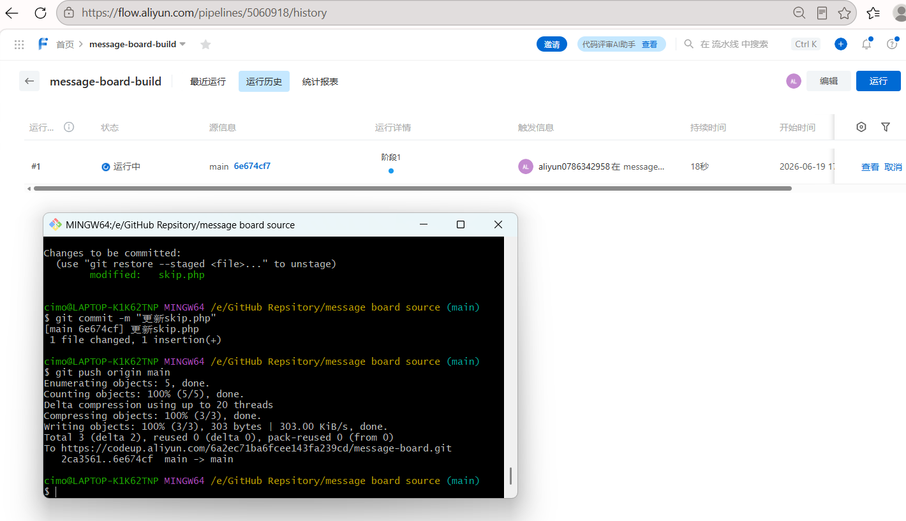
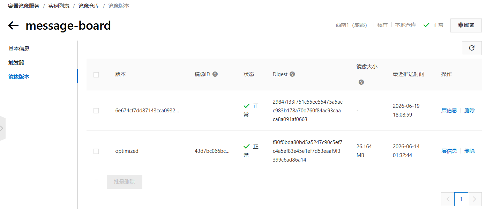

## 云效 Flow 构建流水线

**目标**：搭建生产级构建流水线，实现代码推送后自动构建镜像并推送至 ACR，镜像 Tag 使用 Git 提交哈希保证可追溯。


### 一、核心产出

**流水线名称**：`message-board-build`

**完整链路**：

```
git push 到 Codeup → Webhook 通知云效 → 流水线自动触发
→ 下载全部流水线源（源代码）
→ Docker Buildx 构建镜像
→ 自动登录 ACR（临时令牌）
→ 推送镜像到 registry.cn-chengdu.aliyuncs.com/cam-ns/message-board
→ 镜像 Tag = Git 提交哈希（6e674cf7...）
```


### 二、关键配置项

| 配置项          | 值                                                      | 说明                             |
| --------------- | ------------------------------------------------------- | -------------------------------- |
| 代码源类型      | Codeup                                                  | 绑定 `message-board` 仓库        |
| 触发方式        | 代码源触发（Push 触发）                                 | 需在源配置中手动开启             |
| Webhook 类型    | 流水线源 Webhook                                        | Codeup 侧自动创建，无需手动配置  |
| 监听分支        | main                                                    | 只有推送到 main 分支才触发       |
| 源码下载        | 下载全部流水线源                                        | 必须开启，否则 Dockerfile 找不到 |
| Dockerfile 路径 | `Dockerfile`                                            | 仓库根目录                       |
| ContextPath     | 留空（默认）                                            | 自动指向源码根目录               |
| 镜像仓库地址    | `registry.cn-chengdu.aliyuncs.com/cam-ns/message-board` | 成都 ACR 个人版                  |
| 镜像 Tag        | `${CI_COMMIT_SHA}`                                      | Git 提交哈希，不可变，可追溯     |
| 构建方式        | Docker Buildx                                           | 云效默认，支持多架构构建         |


### 三、遇到的问题与解决方案

#### 问题 1：代码推送后流水线未自动触发

**现象**：`git push` 到 Codeup 成功，但流水线没有自动运行。

**排查过程**：
1.  检查 Codeup 仓库 Webhooks 配置 → 已存在指向云效的 Webhook，测试显示成功。
2.  检查云效流水线源配置 → 发现 **“代码源触发”开关未开启**。

**根因**：Codeup Webhook 负责“通知”，云效“代码源触发”开关负责“开门”。两者缺一不可，开关默认关闭。

**解决**：在流水线编辑页面 → 源代码卡片 → 开启“代码源触发”开关。

---

#### 问题 2：镜像 Tag 变量语法错误

**现象**：构建时报错 `invalid tag "...{{CI_COMMIT_SHA}}": invalid reference format`。

**根因**：`{{}}` 是 Go 模板语法（Helm 使用），云效 Docker 构建任务使用 Shell 风格环境变量 `${}`。

**解决**：将镜像 Tag 从 `{{CI_COMMIT_SHA}}` 改为 `${CI_COMMIT_SHA}`。

---

#### 问题 3：构建时报错找不到 Dockerfile

**现象**：`ENOENT: no such file or directory, open 'Dockerfile'`

**根因**：流水线源配置为“不下载流水线源”，导致代码没有被拉取到构建环境中。

**解决**：在流水线源配置中，将源码下载策略改为 **“下载全部流水线源”**。

**原理**：
-   “下载流水线源”决定代码是否被拉到构建机器。
-   “ContextPath”决定 Docker 构建以哪个目录为上下文。
-   两者协同工作：先拉代码，再在代码目录中执行 `docker build`。

---

#### 问题 4：ACR 控制台不显示镜像大小和层信息

**现象**：流水线显示推送成功，但 ACR 控制台中镜像版本不显示大小和层数。

**根因**：Docker Buildx 默认会推送带有证明（Attestation）的多架构清单，ACR 个人版控制台无法完整解析这类清单的元数据。

**影响**：**无功能影响**。镜像可以正常 `docker pull` 和部署到 ACK。

**可选优化**：在 Docker 构建任务的 Options 中添加 `--provenance=false` 禁用证明，下次构建后控制台即可正常显示。


### 四、最终验证

**流水线运行日志关键行**：
```
#17 pushing manifest for registry.cn-chengdu.aliyuncs.com/cam-ns/message-board:6e674cf7...
#17 DONE 5.8s
[SUCCESS] run step DockerBuildPushACR successfully!
```

**ACR 控制台验证**：
-   进入 ACR → `cam-ns` → `message-board` 仓库 → 镜像版本
-   可见新 Tag `6e674cf7dd87143cca0932029e67bfe47adfc81c`（Git 提交哈希）


